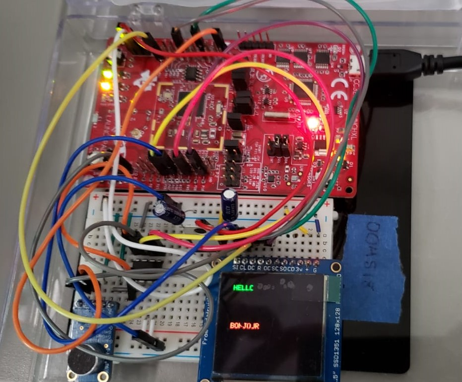
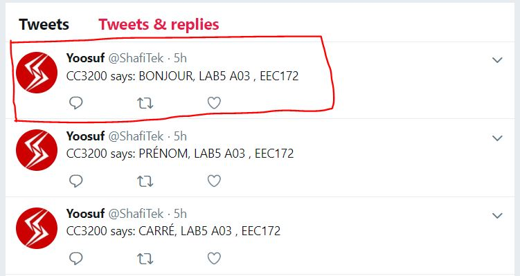

# CC3200 MCU - AWS/GCP IoT and DTMF Texting

Project completion date: June 2019

Class: EEC 172, Spring 2019

Microcontroller: SimpleLink Wi-Fi CC3200 LaunchPad (CC3200-LAUNCHXL)

## Project Description
"In this lab, you will explore the RESTful API and use it to connect with Amazon Web Services (AWS). First, you will create a ‘thing’ in AWS and use the HTTP GET command to retrieve status information about your thing. You will then use your code from Lab 3 to compose messages with an IR remote, which you will send to AWS using the HTTP POST command. You will use a rule in AWS to send the text to your cellphone using Amazon’s Simple Notification Service (SNS). Much of the code you will need for accessing AWS will be provided to you. You will need to understand it at a high-level and modify it for your specific AWS account." - objective given in lab documentation (See `Lab5 v1.1.pdf`)

The AWS part is not in this repo as what is posted here on GitHub is the extra credit section of this lab. However, one could connect to AWS using the same methods used in this repo.

## What the program does

The user composes a text message using DTMF audio signals from their phone which will then be displayed on an OLED display. When the user presses the # key, the message will be securely sent (via SSL) to Google servers for translation. And when the translated message is received, it will:

1. be displayed on the OLED.
2. be sent to <a href = "https://ifttt.com" target="blank">IFTTT</a> servers. IFTTT webhooks are then used to post the message to Twitter. (See images below)

## SOME of the technical stuffs I did
- Leveraged UART and SPI communications protocols.
- Used Goertzel's algorthm to decode the DTMF signals from phone audio to text message.
- Setup various peripherals, and timers.
- Flashed SSL certificates of Amazon, Google, and IFTTT servers.
- Constructed HTTP requests carefully from the bottom up, accounting for newline, carriage returns, etc.

---

| OLED | Twitter |
--- | ---
 | 

---
